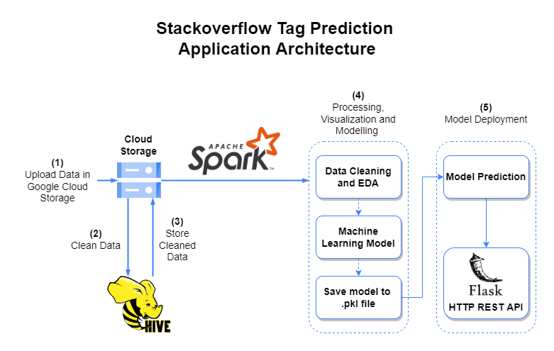

# Cloud-Technologies-Assignment-2-Stackoveflow-Tag-Prediction

# Relevant Files

- **```Queries Used.txt```** - Hive Queries used for Cleaning the Data

- **```1_data-processing.ipynb```** - Data Processing Using PySpark

- **```2_eda-modelling.ipynb```** - Contains code for Exploratory Data Analysis

- **```model_building_v2.ipynb```** - Script contains modelling and performace of the model used

# Executing Front-End Application

All the code for front-end application built using Flask can be found in ```/FlaskApp```. The file ```requirements.txt``` can be found in **FlaskApp folder** as well. Follow the below procedure to execute application.

### 1. Clone the repository

> git clone https://github.com/AdityaBagad/Cloud-Technologies-Assignment-2-Stackoveflow-Tag-Prediction.git

### 2. Install the dependencies using

> cd Cloud-Technologies-Assignment-2-Stackoveflow-Tag-Prediction/FlaskApp

> pip install -r requirements.txt

### 3. Run command to start the application

> python \_\_init\_\_.py

# Application Architecture

 

 # Screenshots


